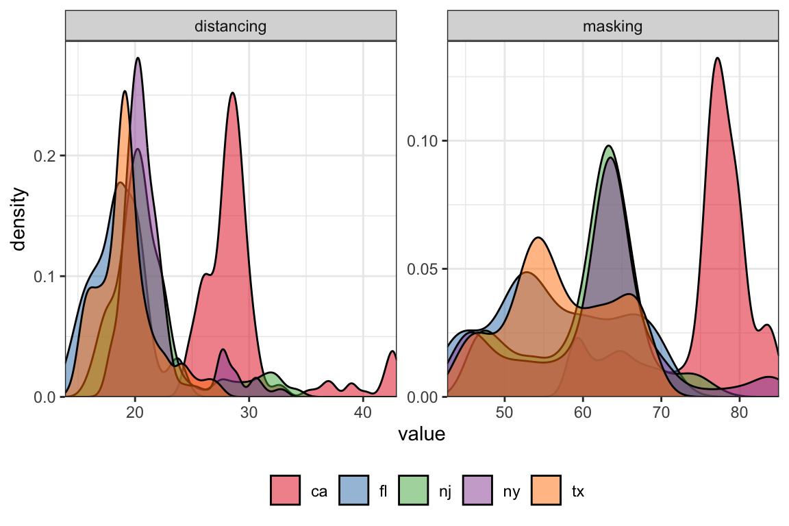

# Examples of Preprocessing and Models


## Introduction 

The `epipredict` package utilizes the `tidymodels` framework, namely 
[`{recipes}`](https://recipes.tidymodels.org/) for 
[dplyr](https://dplyr.tidyverse.org/)-like pipeable sequences 
of feature engineering and [`{parsnip}`](https://parsnip.tidymodels.org/) for a 
unified interface to a range of models. 

`epipredict` has additional customized feature engineering and preprocessing 
steps, such as `step_epi_lag()`, `step_population_scaling()`, 
`step_epi_naomit()`. They can be used along with 
steps from the `{recipes}` package for more feature engineering. 

In this vignette, we will illustrate some examples of how to use `epipredict`
with `recipes` and `parsnip` for different purposes of epidemiological forecasting.
We will focus on basic autoregressive models, in which COVID cases and 
deaths in the near future are predicted using a linear combination of cases and 
deaths in the near past.

The remaining vignette will be split into three sections. The first section, we 
will use a Poisson regression to predict death counts. In the second section,
we will use a linear regression to predict death rates. Last but not least, we
will create a classification model for hotspot predictions. 


```r
library(epidatr)
library(epiprocess)
library(epipredict)
library(recipes)
library(parsnip)
library(workflows)
library(poissonreg)
```

## Poisson Regression 

During COVID-19, the U.S. Centers for Disease Control and Prevention (CDC) collected
models
and forecasts to characterize the state of an outbreak and its course. They use
it to inform public health decision makers on potential consequences of 
deploying control measures.

One of the outcomes that the CDC forecasts is [death counts from COVID-19](https://www.cdc.gov/coronavirus/2019-ncov/science/forecasting/forecasting-us.html).
Although there are many state-of-the-art models, we choose to use Poisson 
regression, the textbook example for modeling count data, as an illustration
for using the `epipredict` package with other existing tidymodels packages. 


```r
geos <- c("ca", "fl", "tx", "ny", "nj")
x <- covidcast(
  data_source = "jhu-csse",
  signals = "confirmed_incidence_num",
  time_type = "day",
  geo_type = "state",
  time_values = epirange(20210604, 20211231),
  geo_values = geos) %>%
  fetch_tbl() %>%
  select(geo_value, time_value, cases = value)

y <- covidcast(
  data_source = "jhu-csse",
  signals = "deaths_incidence_num",
  time_type = "day",
  geo_type = "state",
  time_values = epirange(20210604, 20211231),
  geo_values = geos) %>%
  fetch_tbl() %>%
  select(geo_value, time_value, deaths = value)

counts_subset <- full_join(x, y, by = c("geo_value", "time_value")) %>%
  as_epi_df()
```

The `counts_subset` dataset comes from the `epidatr` package, and 
contains the number of confirmed cases and deaths from June 4, 2021 to 
Dec 31, 2021 in some U.S. states. 

We wish to predict the 7-day ahead death counts with lagged cases and deaths.
Furthermore, we will let each state be a dummy variable. Using differential 
intercept coefficients, we can allow for an intercept shift between states.

One possible model takes the form
\begin{aligned}
\log\left( \mu_{t+7} \right) &{}= \beta_0 + \delta_1 s_{\text{state}_1} +
\delta_2 s_{\text{state}_2} + \cdots +  \nonumber \\ &\quad\beta_1 \text{deaths}_{t} + 
\beta_2 \text{deaths}_{t-7}  + \beta_3 \text{cases}_{t} + 
\beta_4 \text{cases}_{t-7},
\end{aligned}
where $\mu_{t+7} = \mathbb{E}(\text{deaths}_{t+7})$, and $\text{deaths}_{t+7}$
is assumed to follow a Poisson distribution with mean $\mu_{t+7}$;
$s_{\text{state}}$ are dummy variables for each state and take values of either
0 or 1.

Preprocessing steps will be performed to prepare the
data for model fitting. But before diving into them, it will be helpful to understand what `roles` are in the `recipes` framework. 

---

#### Aside on `recipes` {.unnumbered}

`recipes` can assign one or more roles to each column in the data. The roles 
are not restricted to a predefined set; they can be anything. 
For most conventional situations, they are typically “predictor” and/or 
"outcome". Additional roles enable targeted `step_*()` operations on specific 
variables or groups of variables.

In our case, the role `predictor` is given to explanatory variables on the
right-hand side of the model (in the equation above). 
The role `outcome` is the response variable 
that we wish to predict. `geo_value` and `time_value` are predefined roles 
that are unique to the `epipredict` package. Since we work with `epi_df` 
objects, all datasets should have `geo_value` and `time_value` passed through
automatically with these two roles assigned to the appropriate columns in the data.
 
The `recipes` package also allows [manual alterations of roles](https://recipes.tidymodels.org/reference/roles.html) 
in bulk. There are a few handy functions that can be used together to help us 
manipulate variable roles easily. 

> `update_role()` alters an existing role in the recipe or assigns an initial role 
> to variables that do not yet have a declared role.
> 
> `add_role()` adds an additional role to variables that already have a role in 
> the recipe, without overwriting old roles.
> 
> `remove_role()` eliminates a single existing role in the recipe.

#### End aside {.unnumbered}

---

Notice in the following preprocessing steps, we used `add_role()` on 
`geo_value_factor` since, currently, the default role for it is `raw`, but
we would like to reuse this variable as a `predictor`.


```r
counts_subset <- counts_subset %>%
  mutate(geo_value_factor = as.factor(geo_value)) %>%
  as_epi_df()

epi_recipe(counts_subset)

r <- epi_recipe(counts_subset) %>%
  add_role(geo_value_factor, new_role = "predictor") %>%
  step_dummy(geo_value_factor) %>%
  ## Occasionally, data reporting errors / corrections result in negative
  ## cases / deaths
  step_mutate(cases = pmax(cases, 0), deaths = pmax(deaths, 0)) %>%  
  step_epi_lag(cases, deaths, lag = c(0, 7)) %>%
  step_epi_ahead(deaths, ahead = 7, role = "outcome") %>%
  step_epi_naomit()
```

After specifying the preprocessing steps, we will use the `parsnip` package for
modeling and producing the prediction for death count, 7 days after the
latest available date in the dataset. 


```r
latest <- get_test_data(r, counts_subset)

wf <- epi_workflow(r, parsnip::poisson_reg()) %>%
  fit(counts_subset)

predict(wf, latest) %>% filter(!is.na(.pred))
#> An `epi_df` object, 5 x 3 with metadata:
#> * geo_type  = state
#> * time_type = day
#> * as_of     = 2023-04-04 16:26:23
#> 
#> # A tibble: 5 × 3
#>   geo_value time_value .pred
#> * <chr>     <date>     <dbl>
#> 1 ca        2021-12-31 108. 
#> 2 fl        2021-12-31 270. 
#> 3 nj        2021-12-31  22.5
#> 4 ny        2021-12-31  94.8
#> 5 tx        2021-12-31  91.0
```

Note that the `time_value` corresponds to the last available date in the 
training set, **NOT** to the target date of the forecast 
(2022-01-07).


Let's take a look at the fit:

```r
extract_fit_engine(wf)
#> 
#> Call:  stats::glm(formula = ..y ~ ., family = stats::poisson, data = data)
#> 
#> Coefficients:
#>         (Intercept)  geo_value_factor_fl  
#>           3.970e+00           -1.487e-01  
#> geo_value_factor_nj  geo_value_factor_ny  
#>          -1.425e+00           -6.865e-01  
#> geo_value_factor_tx          lag_0_cases  
#>           3.025e-01            1.339e-05  
#>         lag_7_cases         lag_0_deaths  
#>           1.717e-06            1.731e-03  
#>        lag_7_deaths  
#>           8.566e-04  
#> 
#> Degrees of Freedom: 984 Total (i.e. Null);  976 Residual
#> Null Deviance:	    139600 
#> Residual Deviance: 58110 	AIC: 62710
```

Alternative forms of Poisson regression or particular computational approaches
can be applied via arguments to `parsnip::poisson_reg()` for some common
settings, and by using `parsnip::set_engine()` to use a specific Poisson
regression engine and to provide additional engine-specific customization.


## Linear Regression 

For COVID-19, the CDC required submission of case and death count predictions. 
However, the Delphi Group preferred to train on rate data instead, because it 
puts different locations on a similar scale (eliminating the need for location-specific intercepts). 
We can use a linear regression to predict the death rates and use state
population data to scale the rates to counts.[^pois] We will do so using
`layer_population_scaling()` from the `epipredict` package. (We could also use
`step_population_scaling()` from the `epipredict` package to prepare rate data
from count data in the preprocessing recipe.)

[^pois]: We could continue with the Poisson model, but we'll switch to the Gaussian likelihood just for simplicity.

Additionally, when forecasts are submitted, prediction intervals should be 
provided along with the point estimates. This can be obtained via postprocessing
using
`layer_residual_quantiles()`. It is worth pointing out, however, that 
`layer_residual_quantiles()` should be used before population scaling or else 
the transformation will make the results uninterpretable. 

We wish, now, to predict the 7-day ahead death counts with lagged case rates and death
rates, along with some extra behaviourial predictors. Namely, we will use survey data
from [COVID-19 Trends and Impact Survey](https://cmu-delphi.github.io/delphi-epidata/api/covidcast-signals/fb-survey.html#behavior-indicators).

The survey data provides the estimated percentage of people who wore a mask for 
most or all of the time while in public in the past 7 days and the estimated 
percentage of respondents who reported that all or most people they encountered 
in public in the past 7 days maintained a distance of at least 6 feet. 

State-wise population data from the 2019 U.S. Census is included in this package
and will be used in `layer_population_scaling()`. 

```r
behav_ind_mask <- covidcast(
  data_source = "fb-survey",
  signals = "smoothed_wwearing_mask_7d",
  time_type = "day",
  geo_type = "state",
  time_values = epirange(20210604, 20211231),
  geo_values = geos)  %>%
  fetch_tbl() %>%
  select(geo_value, time_value, masking = value)

behav_ind_distancing <- covidcast(
  data_source = "fb-survey",
  signals = "smoothed_wothers_distanced_public",
  time_type = "day",
  geo_type = "state",
  time_values = epirange(20210604, 20211231),
  geo_values = geos)  %>%
  fetch_tbl() %>%
  select(geo_value, time_value, distancing = value) 

pop_dat <- state_census %>% select(abbr, pop)

behav_ind <- behav_ind_mask %>%
  full_join(behav_ind_distancing, by = c("geo_value", "time_value")) 
```

Rather than using raw mask-wearing / social-distancing metrics, for the sake
of illustration, we'll convert both into categorical predictors.



We will take a subset of death rate and case rate data from the built-in dataset 
`case_death_rate_subset`.


```r
jhu <- filter(
  case_death_rate_subset,
  time_value >= "2021-06-04", 
  time_value <= "2021-12-31",
  geo_value %in% c("ca","fl","tx","ny","nj")
)
```

Preprocessing steps will again rely on functions from the `epipredict` package as well
as the `recipes` package.
There are also many functions in the `recipes` package that allow for 
[scalar transformations](https://recipes.tidymodels.org/reference/#step-functions-individual-transformations),
such as log transformations and data centering. In our case, we will 
center the numerical predictors to allow for a more meaningful interpretation of the 
intercept. 


```r
jhu <- jhu %>%
  mutate(geo_value_factor = as.factor(geo_value)) %>%
  left_join(behav_ind, by = c("geo_value", "time_value")) %>%
  as_epi_df()
            
r <- epi_recipe(jhu) %>%
  add_role(geo_value_factor, new_role = "predictor") %>%
  step_dummy(geo_value_factor) %>%
  step_epi_lag(case_rate, death_rate, lag = c(0, 7, 14)) %>%
  step_mutate(masking = cut_number(masking, 5), 
              distancing = cut_number(distancing, 5)) %>%
  step_epi_ahead(death_rate, ahead = 7, role = "outcome") %>%
  step_center(contains("lag"), role = "predictor") %>%
  step_epi_naomit()
```

As a sanity check we can examine the structure of the training data:

```r
glimpse(slice_sample(bake(prep(r, jhu), jhu), n = 6))
#> Rows: 6
#> Columns: 17
#> $ time_value          <date> 2021-07-22, 2021-07-25, 2021-…
#> $ geo_value           <chr> "tx", "ny", "ca", "ca", "fl", …
#> $ case_rate           <dbl> 14.282426, 6.909115, 9.655756,…
#> $ death_rate          <dbl> 0.0836880, 0.0273350, 0.201758…
#> $ masking             <fct> "[42.7,52.8]", "[42.7,52.8]", …
#> $ distancing          <fct> "(18.4,19.8]", "(18.4,19.8]", …
#> $ geo_value_factor_fl <dbl> 0, 0, 0, 0, 1, 0
#> $ geo_value_factor_nj <dbl> 0, 0, 0, 0, 0, 0
#> $ geo_value_factor_ny <dbl> 0, 1, 0, 0, 0, 1
#> $ geo_value_factor_tx <dbl> 1, 0, 0, 0, 0, 0
#> $ lag_0_case_rate     <dbl> -12.65924, -20.03255, -17.2859…
#> $ lag_7_case_rate     <dbl> -18.420571, -22.365630, -12.43…
#> $ lag_14_case_rate    <dbl> -21.587091, -24.008687, -13.60…
#> $ lag_0_death_rate    <dbl> -0.1981856, -0.2545386, -0.080…
#> $ lag_7_death_rate    <dbl> -0.1865082, -0.2523222, -0.068…
#> $ lag_14_death_rate   <dbl> -0.2054840, -0.2567549, -0.065…
#> $ ahead_7_death_rate  <dbl> 0.1221261, 0.0347229, 0.206839…
```

Before directly predicting the results, we need to add postprocessing layers to
obtain the death counts instead of death rates. Note that the rates used so
far are "per 100K people" rather than "per person". We'll also use quantile
regression with the `quantile_reg` engine rather than ordinary least squares
to create median predictions and a 90% prediction interval.


```r
f <- frosting() %>%
  layer_predict() %>%
  layer_add_target_date("2022-01-07") %>% 
  layer_threshold(.pred, lower = 0) %>%
  layer_quantile_distn() %>%
  layer_naomit(.pred) %>%
  layer_population_scaling(
    .pred, .pred_distn, 
    df = pop_dat, 
    rate_rescaling = 1e5,
    by = c("geo_value" = "abbr"), 
    df_pop_col = "pop")

wf <- epi_workflow(r, quantile_reg(tau = c(.05, .5, .95))) %>%
  fit(jhu) %>%
  add_frosting(f)

latest <- get_test_data(recipe = r, x = jhu)
p <- predict(wf, latest)
p
#> An `epi_df` object, 5 x 7 with metadata:
#> * geo_type  = state
#> * time_type = day
#> * as_of     = 2022-05-31 12:08:25
#> 
#> # A tibble: 5 × 7
#>   geo_value time_value               .pred target_date
#> * <chr>     <date>                  <dist> <date>     
#> 1 ca        2021-12-31 [0.05, 0.95]<q-rng> 2022-01-07 
#> 2 fl        2021-12-31 [0.05, 0.95]<q-rng> 2022-01-07 
#> 3 nj        2021-12-31 [0.05, 0.95]<q-rng> 2022-01-07 
#> 4 ny        2021-12-31 [0.05, 0.95]<q-rng> 2022-01-07 
#> 5 tx        2021-12-31 [0.05, 0.95]<q-rng> 2022-01-07 
#> # ℹ 3 more variables: .pred_distn <dist>,
#> #   .pred_scaled <dist>, .pred_distn_scaled <dist>
```

The columns marked `*_scaled` have been rescaled to the correct units, in this
case `deaths` rather than deaths per 100K people (these remain in `.pred`).

To look at the prediction intervals:

```r
p %>%
  select(geo_value, target_date, .pred_scaled, .pred_distn_scaled) %>%
  mutate(.pred_distn_scaled = nested_quantiles(.pred_distn_scaled)) %>%
  unnest(.pred_distn_scaled) %>%
  pivot_wider(names_from = tau, values_from = q)
#> # A tibble: 5 × 5
#>   geo_value target_date        .pred_scaled `0.25` `0.75`
#>   <chr>     <date>                   <dist>  <dbl>  <dbl>
#> 1 ca        2022-01-07  [0.05, 0.95]<q-rng>   48.8   94.0
#> 2 fl        2022-01-07  [0.05, 0.95]<q-rng>   48.4  104. 
#> 3 nj        2022-01-07  [0.05, 0.95]<q-rng>   45.5   68.7
#> 4 ny        2022-01-07  [0.05, 0.95]<q-rng>  108.   163. 
#> 5 tx        2022-01-07  [0.05, 0.95]<q-rng>   68.6  107.
```


Last but not least, let's take a look at the regression fit and check the 
coefficients:

```
#> Call:
#> quantreg::rq(formula = ..y ~ ., tau = ~c(0.05, 0.5, 0.95), data = data, 
#>     na.action = function (object, ...) 
#>     UseMethod("na.omit"), method = "br", model = FALSE)
#> 
#> Coefficients:
#>                        tau= 0.05     tau= 0.50    tau= 0.95
#> (Intercept)          0.210811625  0.2962574475  0.417583265
#> geo_value_factor_fl  0.032085820  0.0482361119  0.171126713
#> geo_value_factor_nj  0.007313762 -0.0033797953 -0.025251865
#> geo_value_factor_ny -0.001489163 -0.0199485947 -0.032635584
#> geo_value_factor_tx  0.029077485  0.0391980273  0.071961515
#> lag_0_case_rate     -0.001636588 -0.0011625693 -0.001430622
#> lag_7_case_rate      0.004700752  0.0057822095  0.006912655
#> lag_14_case_rate     0.001715816  0.0004224753  0.003448733
#> lag_0_death_rate     0.462341754  0.5274192012  0.164856372
#> lag_7_death_rate    -0.007368501  0.1132903956  0.172687438
#> lag_14_death_rate   -0.072500707 -0.0270474349  0.181279299
#> 
#> Degrees of freedom: 950 total; 939 residual
```

## Classification

Sometimes it is preferable to create a predictive model for surges or upswings
rather than for raw values. In this case,
the target is to predict if the future will have increased case rates (denoted `up`),
decreased case rates (`down`), or flat case rates (`flat`) relative to the current
level. Such models may be 
referred to as "hotspot prediction models". We will follow the analysis 
in [McDonald, Bien, Green, Hu, et al.](#references) but extend the application
to predict three categories instead of two. 

Hotspot prediction uses a categorical outcome variable defined in terms of the 
relative change of $Y_{\ell, t+a}$ compared to $Y_{\ell, t}$. 
Where $Y_{\ell, t}$ denotes the case rates in location $\ell$ at time $t$. 
We define the response variables as follows:

$$
 Z_{\ell, t}=
    \begin{cases}
      \text{up}, & \text{if}\ Y^{\Delta}_{\ell, t} > 0.25 \\ 
      \text{down}, & \text{if}\  Y^{\Delta}_{\ell, t} < -0.20\\
      \text{flat}, & \text{otherwise}
    \end{cases}
$$

where $Y^{\Delta}_{\ell, t} = (Y_{\ell, t}- Y_{\ell, t-7})\ /\ (Y_{\ell, t-7})$. 
We say location $\ell$ is a hotspot at time $t$ when $Z_{\ell,t}$ is 
`up`, meaning the number of newly reported cases over the past 7 days has 
increased by at least 25% compared to the preceding week. When $Z_{\ell,t}$ 
is categorized as `down`, it suggests that there has been at least a 20% 
decrease in newly reported cases over the past 7 days (a 20% decrease is the inverse of a 25% increase). Otherwise, we will 
consider the trend to be `flat`. 

The expression of the multinomial regression we will use is as follows:
$$
\pi_{j}(x) = \text{Pr}(Z_{\ell,t} = j|x) = \frac{e^{g_j(x)}}{1 + \sum_{k=0}^2 g_j(x) }
$$
where $j$ is either down, flat, or up

\begin{aligned}
g_{\text{down}}(x) &= 0.\\
g_{\text{flat}}(x)&= \text{ln}\left(\frac{Pr(Z_{\ell,t}=\text{flat}|x)}{Pr(Z_{\ell,t}=\text{down}|x)}\right) = 
\beta_{10} + \beta_{11}t + \delta_{10} s_{\text{state_1}} +
\delta_{11} s_{\text{state_2}} + \cdots \nonumber \\
&\quad + \beta_{12} Y^{\Delta}_{\ell, t} +
\beta_{13} Y^{\Delta}_{\ell, t-7} \\
g_{\text{flat}}(x) &= \text{ln}\left(\frac{Pr(Z_{\ell,t}=\text{up}|x)}{Pr(Z_{\ell,t}=\text{down}|x)}\right) = 
\beta_{20} + \beta_{21}t + \delta_{20} s_{\text{state_1}} +
\delta_{21} s_{\text{state}_2} + \cdots \nonumber \\
&\quad + \beta_{22} Y^{\Delta}_{\ell, t} +
\beta_{23} Y^{\Delta}_{\ell, t-7}
\end{aligned}


Preprocessing steps are similar to the previous models with an additional step 
of categorizing the response variables. Again, we will use a subset of death rate and case rate data from our built-in dataset 
`case_death_rate_subset`.

```r
jhu <- case_death_rate_subset %>%
  dplyr::filter(time_value >= "2021-06-04", 
                time_value <= "2021-12-31",
  geo_value %in% c("ca","fl","tx","ny","nj")) %>%
  mutate(geo_value_factor = as.factor(geo_value)) %>%
  as_epi_df()

r <- epi_recipe(jhu) %>%
  add_role(time_value, new_role = "predictor") %>%
  step_dummy(geo_value_factor) %>%
  step_epi_lag(case_rate, lag = c(0, 7, 14)) %>%
  step_epi_ahead(case_rate, ahead = 7, role = "predictor") %>%
  step_mutate(
    pct_diff_ahead = case_when(
      lag_7_case_rate == 0 ~ 0,
      TRUE ~ (ahead_7_case_rate - lag_0_case_rate) / lag_0_case_rate),
    pct_diff_wk1 = case_when(
      lag_7_case_rate == 0 ~ 0, 
      TRUE ~ (lag_0_case_rate - lag_7_case_rate) / lag_7_case_rate),
    pct_diff_wk2 = case_when(
      lag_14_case_rate == 0 ~ 0,
      TRUE ~ (lag_7_case_rate - lag_14_case_rate) / lag_14_case_rate)) %>%
  step_mutate(
    response = case_when(
      pct_diff_ahead < -0.20 ~ "down",
      pct_diff_ahead > 0.25 ~ "up",
      TRUE ~ "flat"), 
    role = "outcome") %>% 
  step_rm(death_rate, case_rate, lag_0_case_rate,  lag_7_case_rate, 
          lag_14_case_rate, ahead_7_case_rate, pct_diff_ahead) %>%
  step_epi_naomit()
```

We will fit the multinomial regression and examine the predictions:


```r
wf <- epi_workflow(r, parsnip::multinom_reg()) %>%
  fit(jhu)

latest <- get_test_data(recipe = r, x = jhu)
predict(wf, latest) %>% filter(!is.na(.pred_class))
#> An `epi_df` object, 5 x 3 with metadata:
#> * geo_type  = state
#> * time_type = day
#> * as_of     = 2022-05-31 12:08:25
#> 
#> # A tibble: 5 × 3
#>   geo_value time_value .pred_class
#> * <chr>     <date>     <fct>      
#> 1 ca        2021-12-31 up         
#> 2 fl        2021-12-31 up         
#> 3 nj        2021-12-31 up         
#> 4 ny        2021-12-31 up         
#> 5 tx        2021-12-31 flat
```

We can also look at the estimated coefficients and model summary information:

```r
extract_fit_engine(wf)
#> Call:
#> nnet::multinom(formula = ..y ~ ., data = data, trace = FALSE)
#> 
#> Coefficients:
#>      (Intercept)   time_value geo_value_factor_fl
#> flat   -58.11177  0.003162471          -0.5978151
#> up      46.45080 -0.002429847          -0.4682080
#>      geo_value_factor_nj geo_value_factor_ny
#> flat            1.350320            3.113677
#> up              1.572085            3.172692
#>      geo_value_factor_tx pct_diff_wk1 pct_diff_wk2
#> flat          -0.3010305     1.263089     3.610543
#> up            -0.2505232     2.194646     4.266267
#> 
#> Residual Deviance: 1529.929 
#> AIC: 1561.929
```

One could also use a formula in `epi_recipe()` to achieve the same results as 
above. However, only one of `add_formula()`, `add_recipe()`, or 
`workflow_variables()` can be specified. For the purpose of demonstrating 
`add_formula` rather than `add_recipe`, we will `prep` and `bake` our recipe to
return a `data.frame` that could be used for model fitting.

```r
b <- bake(prep(r, jhu), jhu)

epi_workflow() %>%
  add_formula(response ~ geo_value + time_value + pct_diff_wk1 + pct_diff_wk2) %>%
  add_model(parsnip::multinom_reg()) %>%
  fit(data = b)
#> ══ Workflow [trained] ═════════════════════════════════════════════════════════════════════════════════════════════════════════════════════════════════════════════════════════════════════════════════════════════════════════════════════════════════════════════════════════════════════════════════════════════════
#> Preprocessor: Formula
#> Model: multinom_reg()
#> 
#> ── Preprocessor ───────────────────────────────────────────────────────────────────────────────────────────────────────────────────────────────────────────────────────────────────────────────────────────────────────────────────────────────────────────────────────────────────────────────────────────────────────
#> response ~ geo_value + time_value + pct_diff_wk1 + pct_diff_wk2
#> 
#> ── Model ──────────────────────────────────────────────────────────────────────────────────────────────────────────────────────────────────────────────────────────────────────────────────────────────────────────────────────────────────────────────────────────────────────────────────────────────────────────────
#> Call:
#> nnet::multinom(formula = ..y ~ ., data = data, trace = FALSE)
#> 
#> Coefficients:
#>      (Intercept) geo_valuefl geo_valuenj geo_valueny
#> flat   -58.11158  -0.5978159    1.350325    3.113684
#> up      46.45071  -0.4682087    1.572090    3.172698
#>      geo_valuetx   time_value pct_diff_wk1 pct_diff_wk2
#> flat  -0.3010308  0.003162461     1.263093     3.610536
#> up    -0.2505236 -0.002429839     2.194649     4.266259
#> 
#> Residual Deviance: 1529.929 
#> AIC: 1561.929
```

## Benefits of Lagging and Leading in `epipredict`

The `step_epi_ahead` and `step_epi_lag` functions in the `epipredict` package
is handy for creating correct lags and leads for future predictions. 

Let's start with a simple dataset and preprocessing:

```r
ex <- filter(
  case_death_rate_subset, 
  time_value >= "2021-12-01", 
  time_value <= "2021-12-31",
  geo_value == "ca"
)

dim(ex)
#> [1] 31  4
```

We want to predict death rates on 2022-01-07, which is 7 days ahead of the 
latest available date in our dataset. 

We will compare two methods of trying to create lags and leads:

```r
p1 <- epi_recipe(ex) %>%
  step_epi_lag(case_rate, lag = c(0, 7, 14)) %>%
  step_epi_lag(death_rate, lag = c(0, 7, 14)) %>%
  step_epi_ahead(death_rate, ahead = 7, role = "outcome") %>%
  step_epi_naomit() %>%
  prep()

b1 <- bake(p1, ex)
b1
#> # A tibble: 17 × 11
#>    time_value geo_value case_rate death_rate lag_0_case_rate
#>    <date>     <chr>         <dbl>      <dbl>           <dbl>
#>  1 2021-12-15 ca             15.8      0.157            15.8
#>  2 2021-12-16 ca             16.3      0.155            16.3
#>  3 2021-12-17 ca             16.9      0.158            16.9
#>  4 2021-12-18 ca             17.6      0.164            17.6
#>  5 2021-12-19 ca             19.1      0.165            19.1
#>  6 2021-12-20 ca             20.6      0.164            20.6
#>  7 2021-12-21 ca             22.6      0.165            22.6
#>  8 2021-12-22 ca             26.2      0.163            26.2
#>  9 2021-12-23 ca             30.8      0.167            30.8
#> 10 2021-12-24 ca             33.8      0.167            33.8
#> 11 2021-12-25 ca             32.6      0.153            32.6
#> 12 2021-12-26 ca             34.5      0.153            34.5
#> 13 2021-12-27 ca             48.4      0.132            48.4
#> 14 2021-12-28 ca             54.9      0.142            54.9
#> 15 2021-12-29 ca             63.7      0.140            63.7
#> 16 2021-12-30 ca             76.0      0.140            76.0
#> 17 2021-12-31 ca             84.4      0.142            84.4
#> # ℹ 6 more variables: lag_7_case_rate <dbl>,
#> #   lag_14_case_rate <dbl>, lag_0_death_rate <dbl>,
#> #   lag_7_death_rate <dbl>, lag_14_death_rate <dbl>,
#> #   ahead_7_death_rate <dbl>


p2 <- epi_recipe(ex) %>%
  step_mutate(lag0case_rate = lag(case_rate, 0),
              lag7case_rate = lag(case_rate, 7),
              lag14case_rate = lag(case_rate, 14),
              lag0death_rate = lag(death_rate, 0),
              lag7death_rate = lag(death_rate, 7),
              lag14death_rate = lag(death_rate, 14),
              ahead7death_rate = lead(death_rate, 7)) %>%
  step_epi_naomit() %>%
  prep()

b2 <- bake(p2, ex)
b2
#> # A tibble: 10 × 11
#>    time_value geo_value case_rate death_rate lag0case_rate
#>    <date>     <chr>         <dbl>      <dbl>         <dbl>
#>  1 2021-12-15 ca             15.8      0.157          15.8
#>  2 2021-12-16 ca             16.3      0.155          16.3
#>  3 2021-12-17 ca             16.9      0.158          16.9
#>  4 2021-12-18 ca             17.6      0.164          17.6
#>  5 2021-12-19 ca             19.1      0.165          19.1
#>  6 2021-12-20 ca             20.6      0.164          20.6
#>  7 2021-12-21 ca             22.6      0.165          22.6
#>  8 2021-12-22 ca             26.2      0.163          26.2
#>  9 2021-12-23 ca             30.8      0.167          30.8
#> 10 2021-12-24 ca             33.8      0.167          33.8
#> # ℹ 6 more variables: lag7case_rate <dbl>,
#> #   lag14case_rate <dbl>, lag0death_rate <dbl>,
#> #   lag7death_rate <dbl>, lag14death_rate <dbl>,
#> #   ahead7death_rate <dbl>
```

Notice the difference in number of rows `b1` and `b2` returns. This is because 
the second version, the one that doesn't use `step_epi_ahead` and `step_epi_lag`,
has omitted dates compared to the one that used the `epipredict` functions.

```r
dates_used_in_training1 <- b1 %>% 
  select(- ahead_7_death_rate) %>% 
  na.omit() %>% 
  select(time_value)
dates_used_in_training1
#> # A tibble: 17 × 1
#>    time_value
#>    <date>    
#>  1 2021-12-15
#>  2 2021-12-16
#>  3 2021-12-17
#>  4 2021-12-18
#>  5 2021-12-19
#>  6 2021-12-20
#>  7 2021-12-21
#>  8 2021-12-22
#>  9 2021-12-23
#> 10 2021-12-24
#> 11 2021-12-25
#> 12 2021-12-26
#> 13 2021-12-27
#> 14 2021-12-28
#> 15 2021-12-29
#> 16 2021-12-30
#> 17 2021-12-31

dates_used_in_training2 <- b2 %>% 
  select(- ahead7death_rate) %>% 
  na.omit() %>% 
  select(time_value)
dates_used_in_training2
#> # A tibble: 10 × 1
#>    time_value
#>    <date>    
#>  1 2021-12-15
#>  2 2021-12-16
#>  3 2021-12-17
#>  4 2021-12-18
#>  5 2021-12-19
#>  6 2021-12-20
#>  7 2021-12-21
#>  8 2021-12-22
#>  9 2021-12-23
#> 10 2021-12-24
```

The model that is trained based on the `{recipes}` functions will predict 7 days ahead from 
2021-12-24
instead of 7 days ahead from 2021-12-31.

## References

McDonald, Bien, Green, Hu, et al. "Can auxiliary indicators improve COVID-19 
forecasting and hotspot prediction?." Proceedings of the National Academy of 
Sciences 118.51 (2021): e2111453118. [doi:10.1073/pnas.2111453118](
https://doi.org/10.1073/pnas.2111453118)

## Attribution

This vignette contains a modified part of the [COVID-19 Data Repository by the
Center for Systems Science and Engineering (CSSE) at Johns Hopkins
University](https://github.com/CSSEGISandData/COVID-19) as [republished in the
COVIDcast Epidata
API.](https://cmu-delphi.github.io/delphi-epidata/api/covidcast-signals/jhu-csse.html).
See the COVIDcast Epidata API documentation for its modifications, and the code
above for further modifications. This data set is licensed under the terms of
the [Creative Commons Attribution 4.0 International
license](https://creativecommons.org/licenses/by/4.0/) by the Johns Hopkins
University on behalf of its Center for Systems Science in Engineering. Copyright
Johns Hopkins University 2020.
